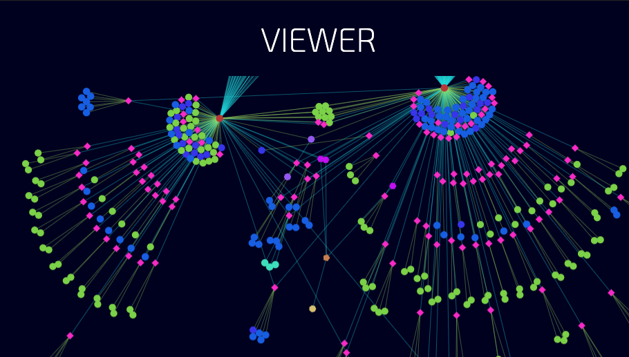

## Features
- Parses and generates a visual representation of any remote RDF resource.
- Supports the following RDF formats: Turtle, TriG, N-Triples, N- - Quads, and Notation3 (N3).
- Identifier based search.
- Type-based search.
- Adjustable node size/ link width.
- Dark Mode.
- Scroll to zoom.
- Constraint layout for acyclic graphs.
- Graphs can be edited (Create/Update/Delete nodes or links).
- Unique colors/shapes based on node/link type.
- Download the modified file at any point.
- Collapsible nodes.
- Option to export analysis.


---
## VIEWER
### Loading an RDF document:
Select one of the TTL URLs available in the dropdown menu or enter your own file URL.

_**Note:** The time taken to analyze and render a graph depends on the size of the TTL file, the configuration and most importantly - your machine’s performance._

_**What to expect:**_

- _The time taken to download, analyze and process depends on your connection speed, the size of the file, the configuration and most importantly - your machine’s performance. You should be able to see a blank viewer after this process is complete._

- _After some time, the viewer will show you tiny node(s) which are the building(s) in the graph._

### Node details:
If you hover over a node instance, it’ll show a tooltip below your pointer that tells you
[ type of the node : name of the node : number of outdegrees it has ]

_**Outdegrees:** The number of links originating from that node._

### Zooming:
To zoom into a node, move your pointer near the node and scroll up. For zoom out, use the scroll down. Alternatively, you can use the zoom in/out buttons on the top right corner.

_**What to expect:**_ 

- _Once a node is large enough, it displays a number on it. This number represents the outdegree. If you don’t see any number, it means that you’re looking at a leaf node (outdegree = 0)._

- _When the node is large enough to fit in its name, the outdegree is not displayed._

### Panning:
To move around, click an empty space and drag the canvas in the desired direction. 

_**Note:** Often a combination of zooming and panning helps in navigating faster._

### Looking at the other nodes:
__Root Elements button:__ This button will collapse all the nodes first and then show only the root nodes (indegree = 0).

__Expand All button:__ This button will expand all the nodes.

### Changing the node size:
Use the node size slider on the left. This quantity is measured in terms of sq. pixels. The default value is 6. 

_**Note:** Clicking on the node size indicator will reset its value._

### Changing the link width:
Use the node size slider on the left. The default value is 0.4. 

_**What to expect:**_ 

- _The link width remains visually constant across various zoom levels._

- _The link arrow size will automatically resize accordingly._

_**Note:** Clicking on the link width indicator will reset its value._

### Searching:
Search can be done based on instance type as well as the ID. To switch between them, use the radio buttons near the Search bar.

_**What to expect:**_

- _When you type a string of letters (regex) in the search field, the nodes that match that pattern will be focused automatically._

- If no nodes match the pattern, the entire graph will be focused._


### Exporting Analysis:
The Export Analysis button will let you download the analysis results of the RDF document in JSON format. It contains the following information:

| Name                   | Description                                   |
|------------------------|-----------------------------------------------|
| uniqueSubjects         | List of unique subjects in the triples        |
| uniquePredicates       | List of unique links (predicates)             |
| uniqueObjects          | List of unique objects in the triples         |
| uniqueTypes            | List of classes whose instances are used      |
| totalNodes             | Total number of nodes in the document         |
| undefinedNodes         | Nodes for which the type is not defined       |
| uniquePrefixes         | IRIs of all the prefixes in the document      |
| selfLinks              | List of triples in which subject = object     |
| typeCount              | Number of instances present of a certain type |
| totalTypesOfNodes      | Total number of unique types                  |
| predicatesCount        | Number of links present of a certain type     |
| totalTypesOfPredicates | Total number of unique predicates             |
| triplesCount           | Total number of triples in the document       |

---
## EDITOR

### Opening/Closing the Editor:
Click on the “Edit” button located on the top right corner of the viewer to open or close the editor.

### Adding a new node:
Click on an empty space on the graph to create a new node at that point. The node/link will be marked as selected (translucent border)

### Selecting:

- Click on a node. If you notice a dark translucent border around it => the node is selected. The node name and node type can be seen on the details pane (right side)

- Click on a link. If you see an increase in its width => link is selected. The link name and its namespace can be seen on the details pane.


### Updating node/link details:
To update the details, edit the name/type field on the details pane and hit **ENTER** to update.

### Deleting node/link:
To delete a link, select the link and press **DELETE**.
To delete a node, select the node and press **DELETE/88.
Note: Deleting a node/link will find and delete all the triples associated with it.

### Downloading the modified document:
Click on the Download button to get the modified document.

---
## Configuration Details

_**Note:** Use the gear icon on the top right corner of the homepage to view or update the configuration. The configuration must be a valid JSON object { }._

### excludePredicates
List of predicates that you don’t want to work with (visualize).
Example: Hiding the “type” predicate which makes the graph messy and confusing. 
Improves the performance of the interactive force graph.

### excludeTypes
List of types of instances that you don’t want to work with (visualize).
Example: Hiding all the “points” when you’re not working with them.
Improves the performance of the interactive force graph.

### defined
Helps BrickStudio to identify the undefined instances.  

Example:

- subject predicate object. :: somePoint label thingY.
We can define the “objects” in a triple containing the label predicate as labels 

- subject predicate object. :: thingX a thingY.
We can say that thingY must be a class and thingX is an instance of the thingY class

### predicateRelationships:
Used to define similar/inverse relationships.

Example: 

```js
{
            "relationship": "https://brickschema.org/schema/1.0.1/BrickFrame#hasPart",
            "similar": [
                "http://buildsys.org/ontologies/BrickFrame#hasPart"
            ],
            "inverse": [
                "https://brickschema.org/schema/1.0.1/BrickFrame#isPartOf",
                "http://buildsys.org/ontologies/BrickFrame#isPartOf",
                "https://brickschema.org/schema/1.0.2/BrickFrame#isPartOf"
            ]
}
```

This will find and replace all the similar triples [ A -> similar -> B] with [A -> relationship ->B] and all inverse relations [A -> inverse -> B] with [B -> relationship -> A]

### excludeSelfLinks (WIP):
Use this to exclude self links from the operation.

### allowOtherParentsToCollapse :
Set this to false if you don’t want all parent nodes to be able to collapse a child node even when some other parent expanded it.


