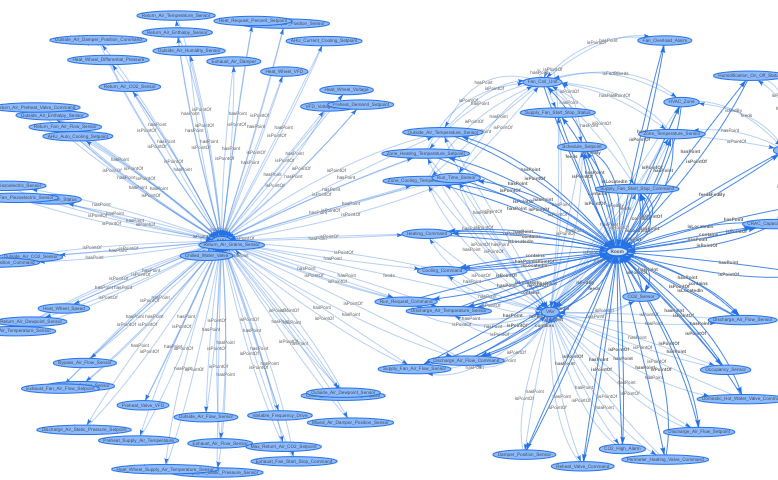

## Introduction
This is a simple site for visualizing how Brick classes are used to describe real buildings. This site does not render the full Brick model; it only visualizes the relationships between instances of classes in order to make visualizing the model tractable. The source for this site can be found here.

## Instructions
To use, upload a .ttl file such as those [found here](https://github.com/BuildSysUniformMetadata/GroundTruth/tree/master/building_instances) and click **`Render`**; this will render a PDF in your browser that shows how instances of Brick classes are connected and what relationships they use.

Alternatively, you can specify the URL of a TTL file you want to use.