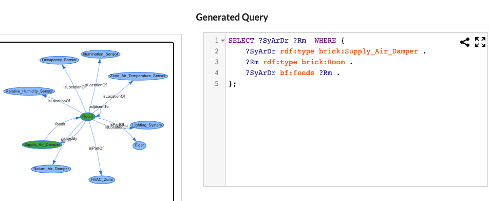

## Introduction
Construct Brick queries interactively by expanding and selecting nodes.

## How To Use
- **Nodes** represent Brick classes appearing in Brick models. **Edges** represent relationships between instances of classes
- **Click** nodes to see their relationships to neighboring nodes.
- **Select** nodes for the query by clicking them. Nodes highlighted in green selected. Click a node again to de-select.
- Click class names in "Start From..." to **reset** the graph content and position
- **Click and drag** to move the graph around.
- **Scroll in and out** to zoom in and out of the graph.