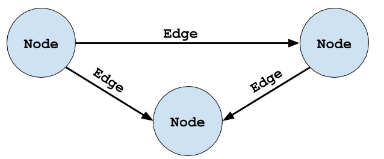

# Brick Overview

Brick is an ontology-based metadata schema that captures the entities and relationships necessary for effective representations of buildings and their subsystems.
Brick describes buildings in a machine readable format to enable programmatic exploration of different operational, structural and functional facets of a building.

## Core Concepts

**Entity**: an entity is an abstraction of any physical, logical or virtual item; the actual "things" in a building.

Expand for more detail...

Physical entities are anything that has a physical presence in the world.
Examples are mechanical equipment such as air handling units, variable air volume boxes, luminaires and lighting systems, networked devices like electric meters, thermostats and electrical vehicle chargers, and spatial elements like rooms and floors.

Virtual entities are anything whose representation is based in software.
Examples are sensing and status points which allow software to read the current state of the world (such as the value of a temperature sensor, the speed of a fan, or the energy consumption of a space heater), and actuation points which allow software to write values (such as temperature setpoints or the brightness of a lighting fixture).

Logical entities are those entities or collections of entities that are defined by a set of rules.
Examples are HVAC zones and Lighting zones.
Concepts such as class names and tags (defined below) also fall into this category.

---

**Tag**: a tag is an atomic fact or attribute of an entity.
Examples of tags are `sensor`, `setpoint`, `air`, `water`, `discharge`, `leaving` and `vav`.
Brick borrows the concept of tags from Project Haystack in order to preserve the flexibility and ease of use for annotation; however, Brick does not rely on tags alone to determine the type of an entity.

---

**Class**: a class is a named category with intensional meaning (a definition) used for grouping entities.
Classes are organized into a hierarchy, and entities are instances of one or more classes (that is, the type of an entity is given by one or more classes).
Classes also have a set of associated tags, which provide helpful annotations for discovery.

---

**Relationship**: a relationship defines the nature of a link between two related entities.
Examples of relationships are *encapsulation* (one entity is contained within another), *sequence* (one entity takes effect before another in some process) and *instantiation* (one entity's type is given by another entity).

---

**Graph**: an abstract organizational data structure representing a set of entities (nodes) and relationships (edges).
Brick is represented by a directed, labeled graph

---

**Brick Model**:
