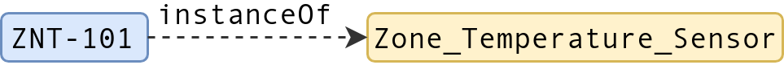

# Brick Overview
Brick formally defines a taxonomy of entity types and the entities' possible relationships. Any entity in a building is an instance of a Brick Class (formally known as TagSet) and can have relationships with other entities. Because each relationship consists of a subject, a predicate, and an object, it's called a triple and a set of triples form a graph for a building (or buildings.) A modeler, either an automated procedure or a human expert, models buildings into Brick graphs. A querier, either an application or a human user, submits query patterns to a query proccesor (usually graph databases) stroing the graph to retrieve entities matched among the model. In this document, we describe the core components of Brick graphs.

# Brick Design Principles
- **Completeness**: A schema should represent all the information (such as a sensor’s location, type, etc.) required by building applications.
- **Expressivity**: A schema should capture diverse relationships across entities without expanding the schema too much.
- **Consistency**: A schema should be able to enforce consistency in modeling processes across different users.
- **Usability**: A schema should be not too complex for users to easily understand and use.
- **Discoverability**: A schema should have a usable query model that apps can rely upon.
- **Extensibility**: A schema should be easily extensible to cover new concepts in a consistent way.

# Entity Instantiation
In Brick models, any entity is an instance of a formally defined class (formally known as TagSets). The figure below shows an example entity where "ZNT-101" is an instance of ``Zone_Temperature_Sensor``. ZNT-101 is the identifier of the entity and Zone_Temperature_Sensor is a class defined in Brick. The class represents the collection of the same type of entities with common properties. Instances of Zone_Temperature_Sensor are sensors measuring the temperature of a certain zone (more specifically a zone's air.)

Consistent usage is the key factor for largely deployable applications over a standard schema. We promote the *consistency* by forcing modelers to use only predefined classes. Classes are formally defined by a class hierarchy and associated Brick Tags.

## Class Hierarchy
Brick introduces four top classes as follows
- **Point**: Points are physical or virtual entities that generate timeseries data. E.g., Temperature_Sensor, Occupancy_Command, Min_Air_Flow_Parameter
- **Equipment**: Physical devices designed for specific tasks controlled by points belonging to it. E.g., light, fan, AHU.
- **Location**: Areas in buildings with various granularities. E.g. room, floor.
- **Resource**: Physical resources or materials that are controlled by equipment and measured by points. E.g., air, water.

***TODO: SOME CLASS HIERARCHY FIGURE***

### More details (It will be foldable)
Each class may have subclasses specifying more detailed properties. A subclass is a subset of its superclass such as Temperature Sensor is a subclass of Sensor, which is a subclass of Point. Subclasses form a hierarchy in a tree-like structure (precisely, a lattice allowing multiple inheritances). While modelers may instantiate a specialized class as much as needed, an application can choose the right abstraction of the class without knowing associated Tags. For example, an app may want to retrieve any kind of Air_Flow_Sensor but not just Supply_Air_Flow_Sensor. Our query mechanism enables transitively selecting any subclasses of a class. This enables the *completeness* for modeling while preserving the *discoverability* for apps' querying. We detail the query mechanism in [TODO]()

##  How Classes are Composed (with Tags)

A class is associated with a certain set of Brick Tags. Brick Tags are keywords containing unit information for modeling buildings. As Tags represent the common properties of a class, they are inherited throughout the class's subclasses. As each class is formally associated with Brick Tags, a user can infer what the class actually is from its associated Tags, which in turn enables Tags-based queries utilized in Project Haystack. Thus, Brick provides *usability* even to users who are only familiar with Tag-based modeling.

***TODO: Example Figure of Point -> Sensor -> Temperature Sensor Tags***

This also helps *extensibility* of our schema.***TODO: Explain the information dimensions and construction rules***

# Entity Relationships
Each entity may have relationships with others, which enriches *expressivity* of Brick other than just using Tags or Classes. A relationship consists of a subject, a predicate, and an object (S-P-O). Because a relationship has three components, it is also called a triple. Below figure shows the possible relationships that instances of top classes may have with each other:

### Figure: Relationships Diagram

++More details (It will be foldable)
### Table: The definition of Relationships
| Relationship (Inverse)     | Definition                                              | Endpoints                                             |
|----------------------------|---------------------------------------------------------|-------------------------------------------------------|
| hasLocation (isLocationOf) | A is physically encapsulated by B                       | Point / Location   Equipment / Location                 |
| hasPart (isPartOf)         | A has some component or part B (typically mechanical)   | Equipment / Equipment  Location / Location             |
| hasPoint (isPointOf)       | A is measured by or is otherwise represented by point B | Equipment / Sensor   Location / Point    Substance / Point |
| feeds (isFedBy)            | A feeds some substances to B                            | Equipment / Equipment   Equipment / Location            |
| controls (isControlledBy)  | A determines or affects the internal state of B         | Point / Point                                         |
### Rules for Relationships
The class of an entity governs what kind of relationships it can have with others. All the rules are in the column "Endpoints" of the above table. The rules regulate the types of subjects and objects that each relationship can have. In RDF, ``rdf:domain`` and ``rdf:range`` specify allowed types of subjects and objects respectively.

### Subproperties
There are more detailed Relationships that subclass other Relationships, which is called Subproperty in RDF. They preserve the semantics of the parent Relationship while specifying more details. For example, ``brick:feedsAir`` is a subproperty of ``brick:feeds`` Relationship handling ``brick:Air`` specifically.
| Relationship     | Definition | Superclass |
|------------------|------------|------------|
| measures         |            | isPointOf  |
| affects          |            | isPointOf  |
| feeds{Substance} |            | feeds      |

### Transitivity
Some Relationships are transitive throughout the model. For example, if the first floor of a building is a part of the building and Room-101 is a part of the first floor, then Room-101 is also a part of the building, as shown in the below figure. Such inferred relationships mitigate human labor and reduce human errors because modelers do not need to specify all the possibly transitive relationships of an entity. Instead, databases (e.g., HodDB, Virtuoso, etc.) or linters help to augment models through inference.

### Inverse Relationship
For the ease of human understanding, Brick supports inverse relationships. Each relationship may be represetned in the reverse order (i.e., O-P'-S instead of S-P-O.) For example, Room-101 is a part of the first floor but, at the same time, the first floor has Room-101 as a part, as shown in the below figure. This gives modelers freedom to select more intuitive direction of relationships while providing the queriers a consistent view. A modeler models Room-101 is a part of the first floor, but a querier can still retrieve the information with a relationship that the first floor has Room-101 as a part. Like transitive relationships, inverse relationships can be inferred by databases or linters automatically as Brick formally defines such relationships.

