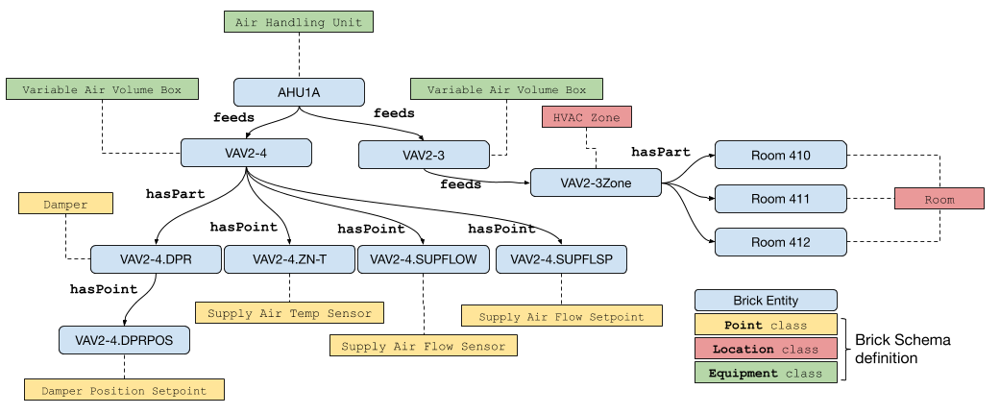

## Concept 1

Brick is an open-source effort to standardize semantic descriptions

Click me!

### Table 1

| Syntax      | Description |
| ----------- | ----------- |
| Header      | Title       |
| Paragraph   | Text        |

_Table 1 Label_

All headings and tables must have a blank line right above them. 

---
## Concept 2

- Width of the image = 7/12 of the maximum : `{class="w-7/12"}`

{class="w-7/12"}

- Width of the image = 5/12 of the maximum, center : `{class="w-5/12 mx-auto"}`

{class="w-5/12 mx-auto"}

## Concept 3

- Use `  ` for forced newline gap
---
One `  `
  

---
Two `  `s
  
  
---